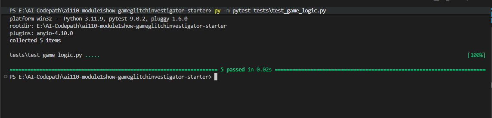
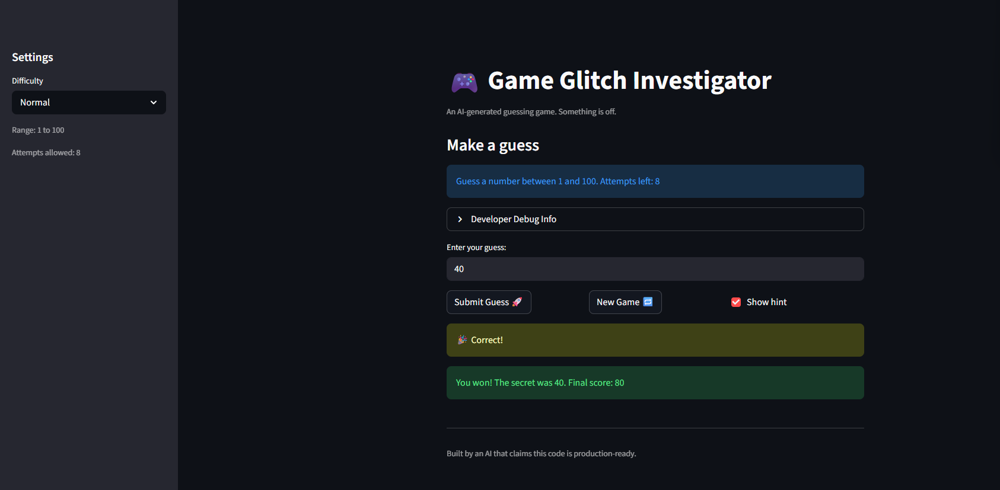

# 🎮 Game Glitch Investigator: The Impossible Guesser

## 🚨 The Situation

You asked an AI to build a simple "Number Guessing Game" using Streamlit.
It wrote the code, ran away, and now the game is unplayable. 

- You can't win.
- The hints lie to you.
- The secret number seems to have commitment issues.

## 🛠️ Setup

1. Install dependencies: `pip install -r requirements.txt`
2. Run the broken app: `python -m streamlit run app.py`

## 🕵️‍♂️ Your Mission

1. **Play the game.** Open the "Developer Debug Info" tab in the app to see the secret number. Try to win.
2. **Find the State Bug.** Why does the secret number change every time you click "Submit"? Ask ChatGPT: *"How do I keep a variable from resetting in Streamlit when I click a button?"*
3. **Fix the Logic.** The hints ("Higher/Lower") are wrong. Fix them.
4. **Refactor & Test.** - Move the logic into `logic_utils.py`.
   - Run `pytest` in your terminal.
   - Keep fixing until all tests pass!

## 📝 Document Your Experience

**Game purpose:**
A Streamlit number-guessing game where the player picks a difficulty (Easy, Normal, Hard), gets a limited number of attempts, and tries to guess a secret number within the correct range. The sidebar shows the range and attempt limit; hints guide the player higher or lower after each guess.

**Bugs found:**

- **Bug 1 — Range mismatch:** The sidebar correctly showed the difficulty range (e.g. 1–20 for Easy), but the info message under "Make a guess" was hardcoded to always say "Guess a number between 1 and 100" regardless of difficulty.
- **Bug 2 — Attempts off by one:** `st.session_state.attempts` was initialized to `1` instead of `0`, so "Attempts left" showed one fewer than it should before any guess was made.
- **Bug 3 — Wrong high/low hints:** On even-numbered attempts, `secret` was cast to a string before being passed to `check_guess`, causing int-vs-string comparisons that produced backwards or incorrect hints.
- **Bug 4 — New game ignored difficulty range:** The "New Game" button called `random.randint(1, 100)` instead of using the actual difficulty range.

**Fixes applied:**

- Replaced the hardcoded `"1 and 100"` in the info message with `f"{low} and {high}"` using the values from `get_range_for_difficulty`.
- Changed `st.session_state.attempts` initialization from `1` to `0`.
- Refactored all game logic (`get_range_for_difficulty`, `parse_guess`, `check_guess`, `update_score`) from `app.py` into `logic_utils.py` and updated imports.
- Fixed `check_guess` to always cast both `guess` and `secret` to `int` before comparing, eliminating the string conversion bug.
- Fixed the "New Game" button to use `random.randint(low, high)` based on the selected difficulty.
- Added `# FIXME` and `# FIX` comments at each bug site documenting the AI collaboration.
- Added 2 regression tests in `tests/test_game_logic.py` targeting Bug 2, and fixed the 3 existing tests that incorrectly expected a plain string from `check_guess` (it returns a tuple).

## 📸 Demo

**Challenge 1 — pytest results (5 tests passing):**

> All 5 tests pass: 3 original `check_guess` tests (fixed to unpack tuple return) + 2 new regression tests for the attempts off-by-one bug.

**Fixed game — winning screen:**

## 🚀 Stretch Features

- [ ] [If you choose to complete Challenge 4, insert a screenshot of your Enhanced Game UI here]
